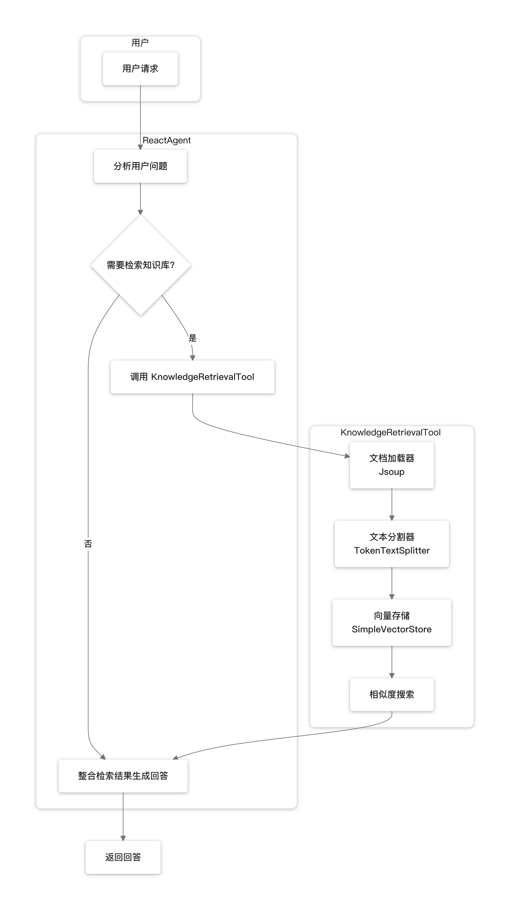

# Agentic RAG Example

## 模块说明

本模块演示了 **Agentic RAG（智能体增强检索生成）** 模式，使用 Spring AI Alibaba 的 `ReactAgent` 结合知识检索工具实现智能体自主决策何时检索知识库的能力。

### 什么是 Agentic RAG？

与传统 RAG 不同，Agentic RAG 让智能体自主决定：
- **是否需要检索**：根据用户问题判断是否需要查询知识库
- **检索什么内容**：智能体自动提取关键词进行检索
- **如何整合信息**：将检索结果与自身知识结合生成回答

## 架构设计



## 核心组件

| 组件 | 说明 |
|------|------|
| `RagAgentApplication` | Spring Boot 应用入口 |
| `RagAgentConfiguration` | ReactAgent 和 ChatClient 配置 |
| `RagAgentController` | Web 控制器，处理用户请求 |
| `KnowledgeRetrievalTool` | 知识检索工具，支持向量相似度搜索 |

## 快速开始

### 1. 配置 API 密钥

设置环境变量：

```bash
export DASHSCOPE_API_KEY=your-api-key-here
```

或在 `application.yml` 中配置：

```yaml
spring:
  ai:
    dashscope:
      api-key: your-api-key-here
```

### 2. 自定义知识源（可选）

在 `application.yml` 中配置知识源 URL：

```yaml
rag:
  knowledge:
    sources:
      - https://your-docs-url-1
      - https://your-docs-url-2
```

### 3. 启动应用

```bash
cd spring-ai-alibaba-agent-example/rag-agent-example
mvn spring-boot:run
```

### 4. 访问 Web 界面

打开浏览器访问：http://localhost:8080

## 接口文档

### Chat 接口

**接口路径：** `POST /api/rag/chat`

**请求参数：**
```json
{
  "message": "用户问题",
  "threadId": "会话ID（可选）"
}
```

**响应：**
```json
{
  "response": "智能体回答",
  "threadId": "会话ID"
}
```

### 示例请求

```bash
curl -X POST http://localhost:8080/api/rag/chat \
  -H "Content-Type: application/json" \
  -d '{"message": "Spring AI Alibaba 如何快速开始？"}'
```

## 技术实现

### 依赖组件

- **Spring Boot 3.x**: 应用框架
- **Spring AI Alibaba**: AI 功能集成
- **ReactAgent**: 智能体框架
- **SimpleVectorStore**: 内存向量存储
- **JsoupDocumentReader**: Web 文档加载
- **DashScope**: 阿里云大模型服务

### 配置要点

- 需要配置 `DASHSCOPE_API_KEY` 环境变量
- 默认端口：8080
- 支持多轮对话（通过 threadId 维护会话状态）

## 扩展指南

### 使用其他向量数据库

可以将 `SimpleVectorStore` 替换为生产级向量数据库：

```java
// 使用 Milvus
@Bean
public VectorStore vectorStore(MilvusServiceClient client, EmbeddingModel embeddingModel) {
    return new MilvusVectorStore(client, embeddingModel);
}

// 使用 PGVector
@Bean
public VectorStore vectorStore(JdbcTemplate jdbcTemplate, EmbeddingModel embeddingModel) {
    return new PgVectorStore(jdbcTemplate, embeddingModel);
}
```

### 注意事项

2. **网络连接**: 需要能够访问阿里云 DashScope 服务
3. **知识源可用性**: 确保配置的知识源 URL 可访问
4. **内存使用**: SimpleVectorStore 将数据存储在内存中，生产环境建议使用持久化向量数据库

---

*此示例展示了 Agentic RAG 模式的核心实现，可作为企业知识问答系统的参考基础。*
