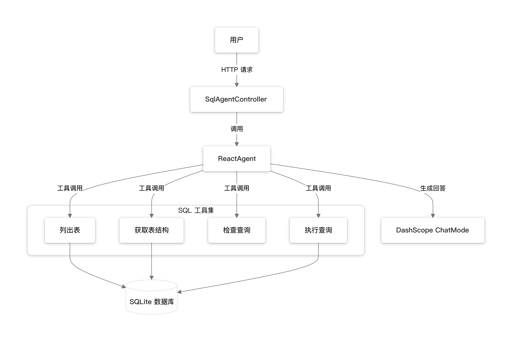

# Spring AI Alibaba SQL Agent Example

本示例演示如何使用 Spring AI Alibaba 的 ReactAgent 框架构建一个 SQL Agent，该 Agent 可以理解自然语言问题并自动生成和执行 SQL 查询。

## 功能特性

- **自然语言转 SQL**: 用户可以用自然语言提问，Agent 自动生成 SQL 查询
- **数据库结构发现**: 自动探索数据库表结构和字段信息
- **SQL 验证**: 执行前使用 LLM 验证 SQL 语法正确性
- **安全执行**: 仅支持 SELECT 查询，阻止 DML 操作（INSERT、UPDATE、DELETE 等）
- **交互式 Web UI**: 提供简洁的聊天界面进行交互

## 架构设计



## 快速开始

### 前置条件

- Java 17+
- Maven 3.6+
- DashScope API Key

### 运行步骤

1. **设置 API Key**

   ```bash
   export DASHSCOPE_API_KEY=your-api-key
   ```

2. **构建项目**

   ```bash
   cd sql-agent-example
   mvn clean package -DskipTests
   ```

3. **运行应用**

   ```bash
   mvn spring-boot:run
   ```

4. **访问 Web UI**

   打开浏览器访问: http://localhost:8080/api/sql/

## 工具说明

| 工具名称 | 功能 | 输入参数 |
|---------|------|---------|
| `list_tables` | 列出数据库所有表 | 无 |
| `get_schema` | 获取指定表的结构和示例数据 | `tables`: 逗号分隔的表名 |
| `check_query` | 使用 LLM 检查 SQL 正确性 | `query`: SQL 查询语句 |
| `execute_query` | 执行 SQL SELECT 查询 | `query`: SQL 查询语句 |

## 示例对话

```
用户: What tables are in the database?

Agent: I can see the following tables in the database: categories, customers, order_items, orders, products.

用户: Show me the top 5 customers by order amount

Agent: Based on my query, here are the top 5 customers by total order amount:
1. Zhang Wei (Beijing) - ¥11,086
2. Li Na (Shanghai) - ¥10,497
3. Chen Jie (Hangzhou) - ¥9,766
...
```

## 示例数据

项目内置了一个电商数据库示例，包含以下表：

- **customers**: 客户信息（姓名、邮箱、城市等）
- **categories**: 商品分类
- **products**: 商品信息（名称、价格、库存等）
- **orders**: 订单信息（客户、日期、状态、金额等）
- **order_items**: 订单明细（商品、数量、单价等）

## 扩展指南

### 连接其他数据库

修改 `application.yml` 中的数据源配置：

```yaml
spring:
  datasource:
    url: jdbc:mysql://localhost:3306/your_database
    driver-class-name: com.mysql.cj.jdbc.Driver
    username: your_username
    password: your_password
```

同时需要在 `pom.xml` 中添加对应的数据库驱动依赖。

### 添加新工具

1. 在 `tool` 包中创建新的工具类，实现 `BiFunction<Request, ToolContext, String>`
2. 在 `SqlAgentConfiguration` 中注册新工具

## 安全注意事项

- Agent 仅支持 SELECT 查询，自动阻止 DML 语句
- 表名经过正则验证，防止基本的 SQL 注入
- 建议使用只读数据库账户连接
- 查询结果默认限制为 10 条

## 相关链接

- [Spring AI Alibaba 文档](https://java2ai.com)
- [Spring AI Alibaba GitHub](https://github.com/alibaba/spring-ai-alibaba)