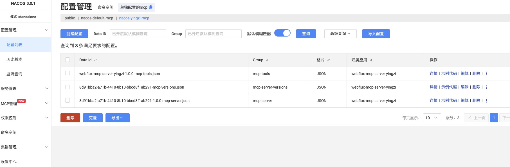
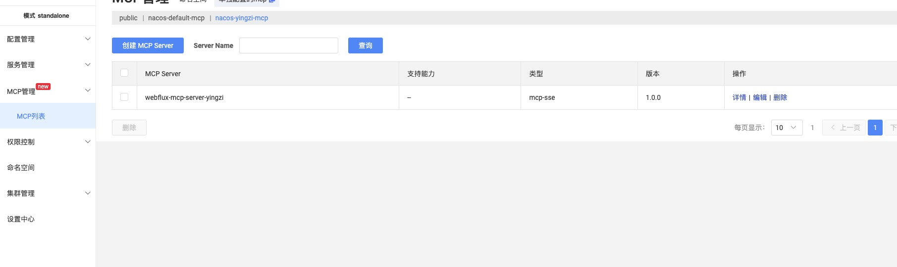

# Spring AI MCP + Nacos 示例项目

本项目是一个基于 [spring-ai-alibaba-mcp-nacos](https://github.com/spring-projects/spring-ai-alibaba) 的简单示例，展示如何将 MCP Server 注册到 Nacos 中，并通过注解式工具（Tool）提供服务。

本示例是MCP Server节点注册在Nacos中，建立稳定性连接，要求版本如下：
1. Nacos版本在3.1.0及以上
2. [spring ai extensions](https://github.com/spring-ai-alibaba/spring-ai-extensions)在1.1.0.0-M4版本及以上

支持如下MCP Server协议类型注册至Nacos中
- SSE
- Streamable
- Stateless（Streamable的一种特殊类型）

## 主要依赖

```xml
<!-- MCP Nacos 注册 -->
<dependency>
    <groupId>com.alibaba.cloud.ai</groupId>
    <artifactId>spring-ai-alibaba-starter-mcp-registry</artifactId>
    <version>${spring-ai-alibaba.extensions.version}</version>
</dependency>
```

## 配置application.yml文件
下面是关于Nacos注册的配置示例：
```yml
spring:
  ai:
    alibaba:
      mcp:
        nacos:
          namespace: 4ad3108b-4d44-43d0-9634-3c1ac4850c8c
          server-addr: 127.0.0.1:8848
          username: nacos
          password: nacos
          register:
            enabled: true
            service-group: mcp-server
            service-name: webflux-mcp-server
```

## 快速启动说明
1. 引入上述pom文件依赖 + 配置文件信息
2. 可将当前MCP Server（SSE、Streamable、Stateless）服务注册至Nacos中

## 运行效果验证
当首次启动MCP Server服务时，MCP Server将注册至Nacos中，并生成相应的配置信息，如下图所示：




## 注意事项
在以下情况下需要删除Nacos中的配置管理信息，否则将启动失败
1. 当前mcp server服务的工具信息变更
2. 当前mcp server服务的协议类型变更